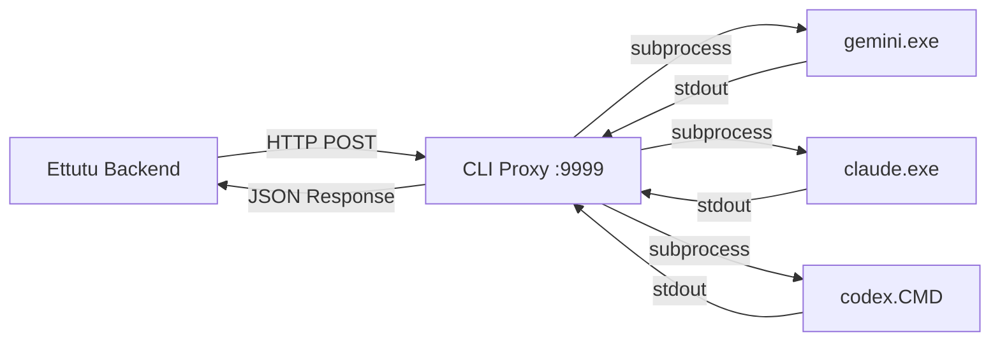

# CLI Bridge - User Guide

The **CLI Bridge** feature allows Ettutu V2 to use locally installed AI CLI tools (Gemini CLI, Claude CLI, Codex CLI) as LLM providers. This is particularly useful when running the application in Docker containers, as it bridges the gap between containerized services and host-installed CLI tools.

---

## Overview

The CLI Bridge consists of three main components:

1. **CLI Proxy Script** - A lightweight HTTP server running on your Windows host
2. **CLI Bridge Provider** - A provider configuration in Ettutu's LLM settings
3. **CLI Models Configuration** - Defines which models are available for each CLI type



---

## Quick Start

### Step 1: Install CLI Tools

Before using CLI Bridge, install the CLI tools you want to use:

| CLI Tool       | Installation                                                |
| -------------- | ----------------------------------------------------------- |
| **Gemini CLI** | `npm install -g @google/gemini-cli` or download from Google |
| **Claude CLI** | `npm install -g @anthropic-ai/claude-cli`                   |
| **Codex CLI**  | `npm install -g @openai/codex`                              |

### Step 2: Start the CLI Proxy

Open a PowerShell terminal on your Windows host and run:

```powershell
cd d:\Workspaces\Ettutu V2
python tools/cli_proxy.py
```

You'll see output like:

```
============================================================
  CLI Bridge Proxy Server
============================================================
  Host: 0.0.0.0
  Port: 9999
  API Key: Disabled

  Gemini CLI: C:\Users\...\AppData\Roaming\npm\gemini.cmd
  Claude CLI: C:\Users\...\AppData\Roaming\npm\claude.cmd
  Codex CLI: C:\Users\...\AppData\Roaming\npm\codex.CMD

  Docker URL: http://host.docker.internal:9999
============================================================
```

> [!TIP]
> Keep this terminal open while using CLI Bridge. You can also create a batch file to start it automatically (see [Batch File Setup](#batch-file-setup) below).

### Step 3: Configure CLI Bridge Provider

1. Open **Settings → LLM Providers** in the Ettutu UI
2. Click **+ Add Provider**
3. Select **CLI Bridge** as the provider type
4. Configure:
   - **Name**: A friendly name (e.g., "CLI Gemini", "CLI Codex")
   - **CLI Type**: Select `gemini`, `claude`, or `codex`
   - **Proxy URL**: Leave empty to use default, or set to `http://host.docker.internal:9999` for Docker
5. Click **Save**

### Step 4: Assign to LLM Specialists

1. Go to **Settings → LLM Providers** and scroll down to **LLM Workforce**
2. For each specialist role (Manager, Handler, Analyst, etc.):
   - Select your CLI Bridge provider from the **Provider** dropdown
   - Select a model from the **Available Models** dropdown
   - Adjust **Temperature** as needed
   - Click **Save**

---

## Settings Sections

### CLI Models Section

Navigate to **Settings → CLI Models** to manage which models are available for each CLI type.

#### Features

- **Tabs for each CLI type**: Gemini, Claude, Codex
- **Add Model**: Click **+ Add Model** to add a new model
- **Delete Model**: Click the trash icon to remove a model
- **Auto-save**: Changes are saved to `backend/config/cli_models.json`

#### Model Properties

| Field           | Description                                                                                      |
| --------------- | ------------------------------------------------------------------------------------------------ |
| **ID**          | The exact model identifier used by the CLI (e.g., `gemini-2.5-flash`, `sonnet`, `gpt-5.2-codex`) |
| **Name**        | Human-readable display name                                                                      |
| **Description** | Brief description of the model's capabilities                                                    |

#### Default Models

**Gemini CLI:**

- `gemini-3-pro-preview` - Advanced reasoning, multimodal
- `gemini-3-flash-preview` - Speed optimized, high-frequency agentic
- `gemini-2.5-pro` - 1M context, large datasets/codebases
- `gemini-2.5-flash` - High-performance, low-latency
- `gemini-2.5-flash-lite` - Fastest, cost-efficient

**Claude CLI:**

- `sonnet` - Claude 3.5 Sonnet, balanced performance
- `opus` - Claude 3 Opus, most powerful
- `haiku` - Claude 3.5 Haiku, fastest

**Codex CLI:**

- `gpt-5.2-codex` - Latest frontier agentic coding model
- `gpt-5.1-codex-max` - Codex-optimized flagship
- `gpt-5.1-codex-mini` - Cheaper, faster option
- `gpt-5.2` - Latest frontier model

---

### LLM Providers Section

Navigate to **Settings → LLM Providers** to manage your CLI Bridge provider instances.

#### Adding a CLI Bridge Provider

1. Click **+ Add Provider**
2. Fill in:
   - **Provider Type**: Select `CLI Bridge`
   - **Name**: Give it a descriptive name (e.g., "CLI Gemini", "CLI Codex")
   - **CLI Type**: Choose `gemini`, `claude`, or `codex`
   - **Proxy URL**: Usually leave empty (auto-detected)
3. Click **Add Provider**

#### Testing the Provider

Click the **Test** button on any provider card to verify:

- The proxy is running and reachable
- The CLI tool is installed and detected
- The connection is working properly

---

### LLM Workforce Section

The **LLM Workforce** section (at the bottom of LLM Providers page) lets you assign providers and models to specialist roles.

#### Specialist Roles

| Role            | Purpose                                   |
| --------------- | ----------------------------------------- |
| **Manager LLM** | Coordinates tasks and routes requests     |
| **Handler LLM** | Handles specific subtasks                 |
| **Analyst LLM** | Analyzes leads and extracts business data |
| **Crawler LLM** | LLM-enhanced web crawling                 |
| **Chat LLM**    | Chat interface conversations              |

#### Configuring a Specialist

1. **Select Provider**: Choose your CLI Bridge provider from the dropdown
2. **Enter Model Name**: Type the exact model ID, OR
3. **Select from Available Models**: Use the searchable dropdown to pick a model
4. **Adjust Temperature**: Slide between Deterministic (0) and Creative (2)
5. Click **Save**

> [!NOTE]
> The model dropdown shows models from `cli_models.json`. If a model isn't listed, you can still type it manually in the "Model Name" field.

---

## CLI Proxy Script

### Location

```
d:\Workspaces\Ettutu V2\tools\cli_proxy.py
```

### Command-Line Options

```powershell
python tools/cli_proxy.py [OPTIONS]
```

| Option      | Default   | Description                   |
| ----------- | --------- | ----------------------------- |
| `--port`    | `9999`    | Port to run the proxy on      |
| `--host`    | `0.0.0.0` | Host to bind to               |
| `--api-key` | None      | Optional API key for security |

### Examples

```powershell
# Default settings
python tools/cli_proxy.py

# Custom port
python tools/cli_proxy.py --port 8888

# With API key for security
python tools/cli_proxy.py --api-key my-secret-key
```

### Batch File Setup

Create a batch file for easy startup:

**File: `start_cli_proxy.bat`**

```batch
@echo off
echo Starting CLI Bridge Proxy...
cd /d "d:\Workspaces\Ettutu V2"
python tools/cli_proxy.py
pause
```

Or for PowerShell:

**File: `start_cli_proxy.ps1`**

```powershell
Write-Host "Starting CLI Bridge Proxy..." -ForegroundColor Cyan
Set-Location "d:\Workspaces\Ettutu V2"
python tools/cli_proxy.py
```

> [!TIP]
> Add the batch file to your Windows startup folder to auto-start the proxy on login.

---

## Verification

### Check Proxy Health

```powershell
curl http://localhost:9999/health
```

Expected response:

```json
{
  "status": "healthy",
  "gemini_available": true,
  "claude_available": true,
  "codex_available": true,
  "gemini_path": "C:\\Users\\...\\gemini.cmd",
  "claude_path": "C:\\Users\\...\\claude.cmd",
  "codex_path": "C:\\Users\\...\\codex.CMD"
}
```

### Test from Docker Container

```powershell
docker exec ettutu-api curl http://host.docker.internal:9999/health
```

### Test Provider in UI

1. Go to **Settings → LLM Providers**
2. Find your CLI Bridge provider
3. Click **Test**
4. Check for green checkmark ✓

---

## Troubleshooting

| Problem                             | Solution                                                                                            |
| ----------------------------------- | --------------------------------------------------------------------------------------------------- |
| **Proxy not reachable from Docker** | Ensure Windows Firewall allows port 9999. Check if `host.docker.internal` resolves correctly.       |
| **CLI not found**                   | Install the CLI tool (`npm install -g @google/gemini-cli`) and restart the proxy.                   |
| **Timeout errors**                  | Increase timeout in the provider config or check if the CLI is responding slowly.                   |
| **"unexpected argument" errors**    | Make sure you're using the correct CLI version. Each CLI has different argument formats.            |
| **Model not supported**             | Check if the model exists in your account/subscription. Update `cli_models.json` with valid models. |
| **Empty response**                  | Check the CLI proxy terminal for error messages. The CLI might require authentication.              |

---

## Best Practices

1. **Keep the proxy running**: The CLI proxy must be running whenever you want to use CLI Bridge providers.

2. **Use appropriate models**:

   - For **Analyst** role: Use more capable models (gemini-2.5-pro, sonnet, gpt-5.2-codex)
   - For **Handler** role: Balanced models work well
   - For **Crawler** role: Faster models (flash-lite, haiku, mini) for quick tasks

3. **Monitor the proxy**: Watch the CLI proxy terminal for execution logs and errors.

4. **Security**: If exposing the proxy beyond localhost, use the `--api-key` option.

5. **Update models regularly**: CLI tools add new models over time. Update `cli_models.json` when new models become available.
